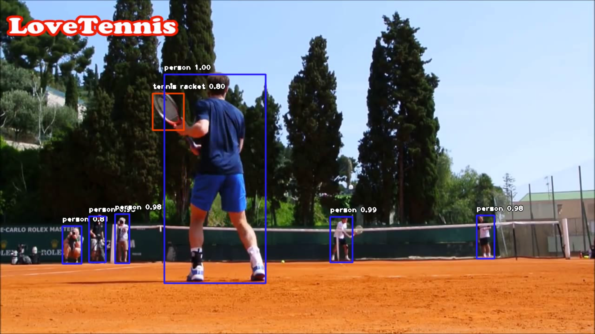

# Final Product

# Personal Background:
I was born and raised in Tallahassee, Florida. My childhood revolved around competitive junior tennis. I was an extremely successful junior tennis player. I was the number 1 tennis player in the country in the 12s, 14s, 16s, and 18s boys division for the united states. I am currently a professional tennis player studying computer science at Florida State University with a full athletic scholarship. Ever since I could remember I have always had a love for technology and once I learned what a programming was at 12 years old, I knew it was something I wanted to do for the rest of my life.
# Project Overview:
In this project I have used the imageAI library along with YoloV3 for object recognition on Andy Murray. I am a professional tennis player so my motivation for this project was to use the imageAI library on my favorite professional players. 
# ImageAI library:
"A python library built to empower developers to build applications and systems with self-contained Deep Learning and Computer Vision capabilities using simple and few lines of code". 
https://github.com/OlafenwaMoses/ImageAI
